# Project Kage - Complete Feature Flow Documentation
**Purpose**: Step-by-step logic documentation for every feature in the app

---

## 🎯 **GOAL MANAGEMENT FLOWS**

### **Goal Creation Flow (Template Path)**
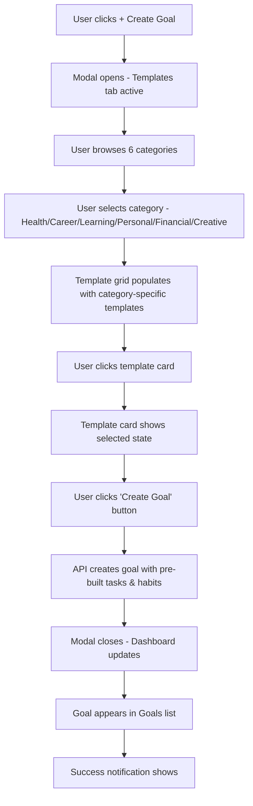
```mermaid
graph TD
    A[User clicks + Create Goal] --> B[Modal opens - Templates tab active]
    B --> C[User browses 6 categories]
    C --> D[User selects category - Health/Career/Learning/Personal/Financial/Creative]
    D --> E[Template grid populates with category-specific templates]
    E --> F[User clicks template card]
    F --> G[Template card shows selected state]
    G --> H[User clicks 'Create Goal' button]
    H --> I[API creates goal with pre-built tasks & habits]
    I --> J[Modal closes - Dashboard updates]
    J --> K[Goal appears in Goals list]
    K --> L[Success notification shows]
```

### **Goal Creation Flow (Custom Path)**
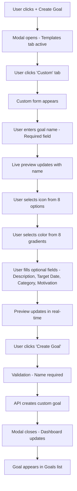
```mermaid
graph TD
    A[User clicks + Create Goal] --> B[Modal opens - Templates tab active]
    B --> C[User clicks 'Custom' tab]
    C --> D[Custom form appears]
    D --> E[User enters goal name - Required field]
    E --> F[Live preview updates with name]
    F --> G[User selects icon from 8 options]
    G --> H[User selects color from 8 gradients]
    H --> I[User fills optional fields - Description, Target Date, Category, Motivation]
    I --> J[Preview updates in real-time]
    J --> K[User clicks 'Create Goal']
    K --> L[Validation - Name required]
    L --> M[API creates custom goal]
    M --> N[Modal closes - Dashboard updates]
    N --> O[Goal appears in Goals list]
```

### **Goal Detail View Flow**
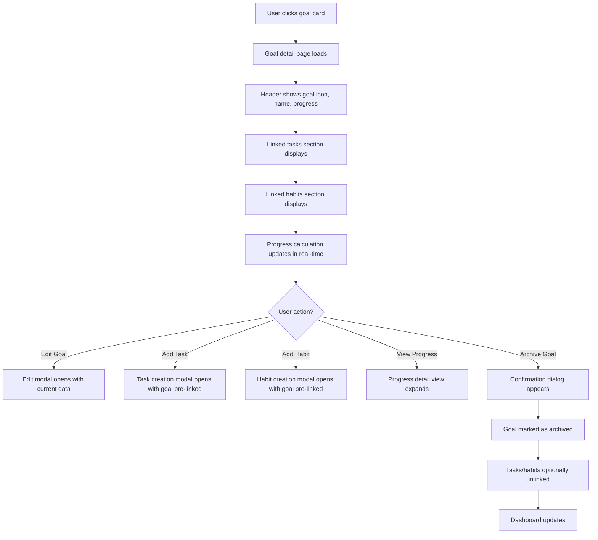
```mermaid
graph TD
    A[User clicks goal card] --> B[Goal detail page loads]
    B --> C[Header shows goal icon, name, progress]
    C --> D[Linked tasks section displays]
    D --> E[Linked habits section displays]
    E --> F[Progress calculation updates in real-time]
    F --> G{User action?}
    G -->|Edit Goal| H[Edit modal opens with current data]
    G -->|Add Task| I[Task creation modal opens with goal pre-linked]
    G -->|Add Habit| J[Habit creation modal opens with goal pre-linked]
    G -->|View Progress| K[Progress detail view expands]
    G -->|Archive Goal| L[Confirmation dialog appears]
    L --> M[Goal marked as archived]
    M --> N[Tasks/habits optionally unlinked]
    N --> O[Dashboard updates]
```

---

## ✅ **TASK MANAGEMENT FLOWS**

### **Task Creation Flow**
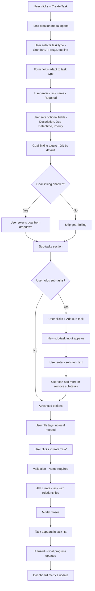
```mermaid
graph TD
    A[User clicks + Create Task] --> B[Task creation modal opens]
    B --> C[User selects task type - Standard/To-Buy/Deadline]
    C --> D[Form fields adapt to task type]
    D --> E[User enters task name - Required]
    E --> F[User sets optional fields - Description, Due Date/Time, Priority]
    F --> G[Goal linking toggle - ON by default]
    G --> H{Goal linking enabled?}
    H -->|Yes| I[User selects goal from dropdown]
    H -->|No| J[Skip goal linking]
    I --> K[Sub-tasks section]
    J --> K
    K --> L{User adds sub-tasks?}
    L -->|Yes| M[User clicks + Add sub-task]
    L -->|No| N[Advanced options]
    M --> O[New sub-task input appears]
    O --> P[User enters sub-task text]
    P --> Q[User can add more or remove sub-tasks]
    Q --> N
    N --> R[User fills tags, notes if needed]
    R --> S[User clicks 'Create Task']
    S --> T[Validation - Name required]
    T --> U[API creates task with relationships]
    U --> V[Modal closes]
    V --> W[Task appears in task list]
    W --> X[If linked - Goal progress updates]
    X --> Y[Dashboard metrics update]
```

### **Task Completion Flow**
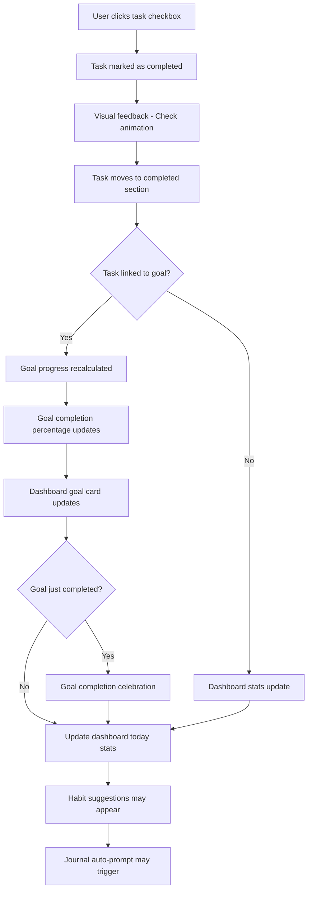
```mermaid
graph TD
    A[User clicks task checkbox] --> B[Task marked as completed]
    B --> C[Visual feedback - Check animation]
    C --> D[Task moves to completed section]
    D --> E{Task linked to goal?}
    E -->|Yes| F[Goal progress recalculated]
    E -->|No| G[Dashboard stats update]
    F --> H[Goal completion percentage updates]
    H --> I[Dashboard goal card updates]
    I --> J{Goal just completed?}
    J -->|Yes| K[Goal completion celebration]
    J -->|No| L[Update dashboard today stats]
    K --> L
    G --> L
    L --> M[Habit suggestions may appear]
    M --> N[Journal auto-prompt may trigger]
```

### **Sub-task Management Flow**
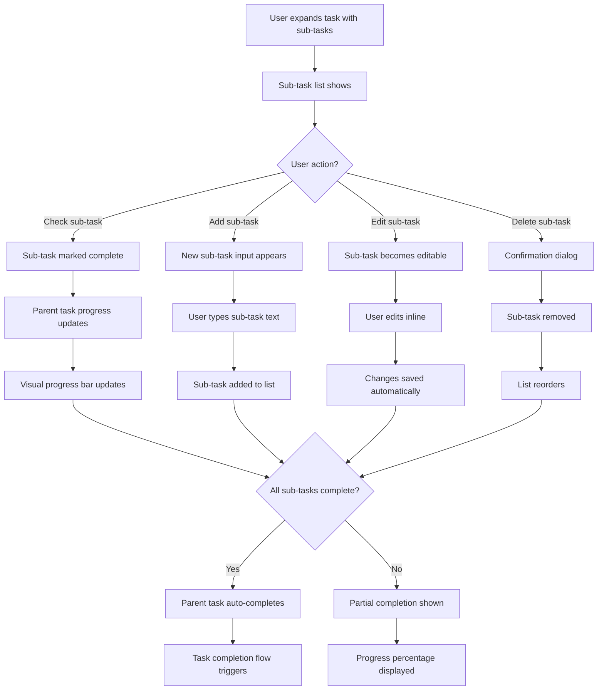
```mermaid
graph TD
    A[User expands task with sub-tasks] --> B[Sub-task list shows]
    B --> C{User action?}
    C -->|Check sub-task| D[Sub-task marked complete]
    C -->|Add sub-task| E[New sub-task input appears]
    C -->|Edit sub-task| F[Sub-task becomes editable]
    C -->|Delete sub-task| G[Confirmation dialog]
    D --> H[Parent task progress updates]
    E --> I[User types sub-task text]
    F --> J[User edits inline]
    G --> K[Sub-task removed]
    H --> L[Visual progress bar updates]
    I --> M[Sub-task added to list]
    J --> N[Changes saved automatically]
    K --> O[List reorders]
    L --> P{All sub-tasks complete?}
    M --> P
    N --> P
    O --> P
    P -->|Yes| Q[Parent task auto-completes]
    P -->|No| R[Partial completion shown]
    Q --> S[Task completion flow triggers]
    R --> T[Progress percentage displayed]
```

---

## 🔄 **HABIT TRACKING FLOWS**

### **Habit Creation Flow**
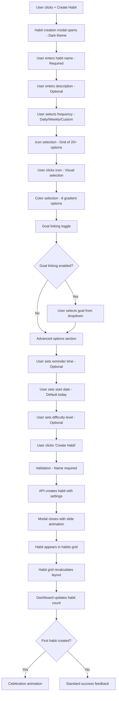
```mermaid
graph TD
    A[User clicks + Create Habit] --> B[Habit creation modal opens - Dark theme]
    B --> C[User enters habit name - Required]
    C --> D[User enters description - Optional]
    D --> E[User selects frequency - Daily/Weekly/Custom]
    E --> F[Icon selection - Grid of 20+ options]
    F --> G[User clicks icon - Visual selection]
    G --> H[Color selection - 8 gradient options]
    H --> I[Goal linking toggle]
    I --> J{Goal linking enabled?}
    J -->|Yes| K[User selects goal from dropdown]
    J -->|No| L[Advanced options section]
    K --> L
    L --> M[User sets reminder time - Optional]
    M --> N[User sets start date - Default today]
    N --> O[User sets difficulty level - Optional]
    O --> P[User clicks 'Create Habit']
    P --> Q[Validation - Name required]
    Q --> R[API creates habit with settings]
    R --> S[Modal closes with slide animation]
    S --> T[Habit appears in habits grid]
    T --> U[Habit grid recalculates layout]
    U --> V[Dashboard updates habit count]
    V --> W{First habit created?}
    W -->|Yes| X[Celebration animation]
    W -->|No| Y[Standard success feedback]
```

### **Habit Completion Flow**
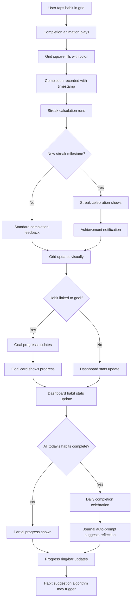
```mermaid
graph TD
    A[User taps habit in grid] --> B[Completion animation plays]
    B --> C[Grid square fills with color]
    C --> D[Completion recorded with timestamp]
    D --> E[Streak calculation runs]
    E --> F{New streak milestone?}
    F -->|Yes| G[Streak celebration shows]
    F -->|No| H[Standard completion feedback]
    G --> I[Achievement notification]
    H --> J[Grid updates visually]
    I --> J
    J --> K{Habit linked to goal?}
    K -->|Yes| L[Goal progress updates]
    K -->|No| M[Dashboard stats update]
    L --> N[Goal card shows progress]
    N --> O[Dashboard habit stats update]
    M --> O
    O --> P{All today's habits complete?}
    P -->|Yes| Q[Daily completion celebration]
    P -->|No| R[Partial progress shown]
    Q --> S[Journal auto-prompt suggests reflection]
    R --> T[Progress ring/bar updates]
    S --> T
    T --> U[Habit suggestion algorithm may trigger]
```

### **Habit Grid Interaction Flow**
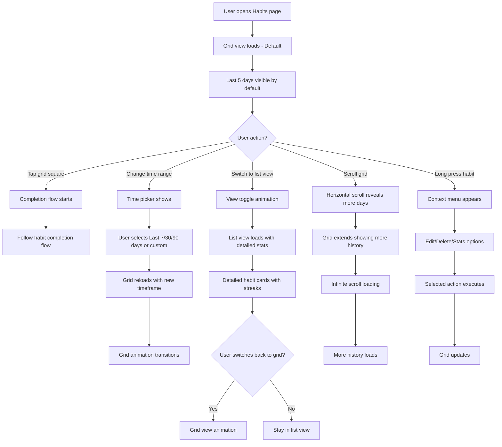
```mermaid
graph TD
    A[User opens Habits page] --> B[Grid view loads - Default]
    B --> C[Last 5 days visible by default]
    C --> D{User action?}
    D -->|Tap grid square| E[Completion flow starts]
    D -->|Change time range| F[Time picker shows]
    D -->|Switch to list view| G[View toggle animation]
    D -->|Scroll grid| H[Horizontal scroll reveals more days]
    D -->|Long press habit| I[Context menu appears]
    E --> J[Follow habit completion flow]
    F --> K[User selects Last 7/30/90 days or custom]
    G --> L[List view loads with detailed stats]
    H --> M[Grid extends showing more history]
    I --> N[Edit/Delete/Stats options]
    K --> O[Grid reloads with new timeframe]
    L --> P[Detailed habit cards with streaks]
    M --> Q[Infinite scroll loading]
    N --> R[Selected action executes]
    O --> S[Grid animation transitions]
    P --> T{User switches back to grid?}
    Q --> U[More history loads]
    R --> V[Grid updates]
    T -->|Yes| W[Grid view animation]
    T -->|No| X[Stay in list view]
```

---

## 📅 **CALENDAR INTEGRATION FLOWS**

### **Calendar View Flow**
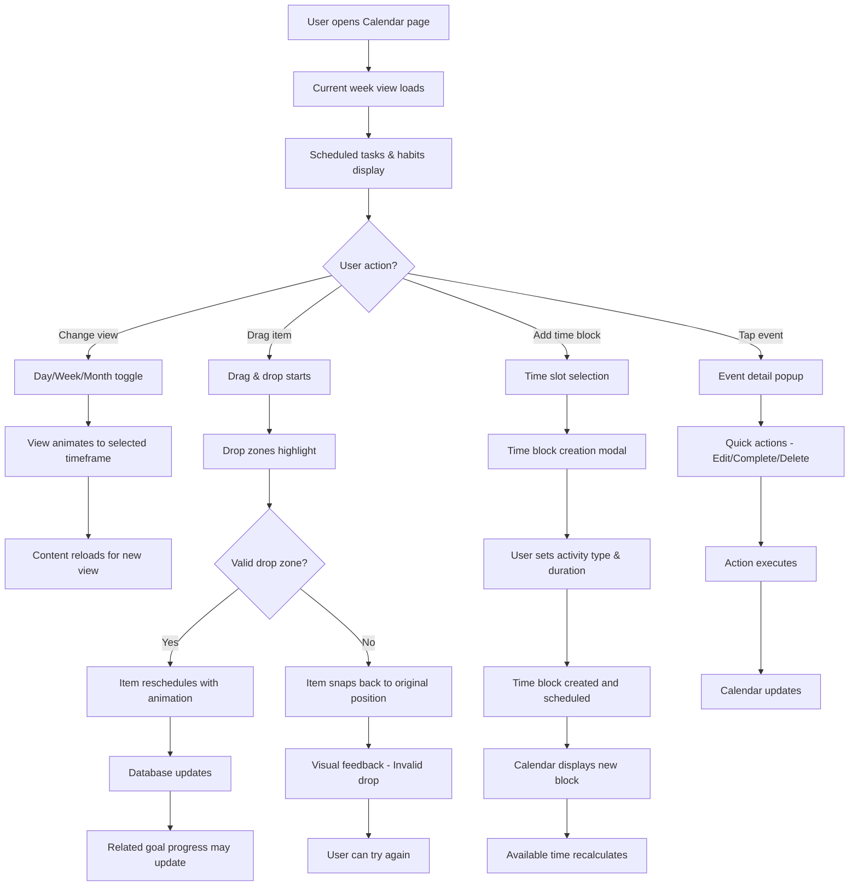
```mermaid
graph TD
    A[User opens Calendar page] --> B[Current week view loads]
    B --> C[Scheduled tasks & habits display]
    C --> D{User action?}
    D -->|Change view| E[Day/Week/Month toggle]
    D -->|Drag item| F[Drag & drop starts]
    D -->|Add time block| G[Time slot selection]
    D -->|Tap event| H[Event detail popup]
    E --> I[View animates to selected timeframe]
    F --> J[Drop zones highlight]
    G --> K[Time block creation modal]
    H --> L[Quick actions - Edit/Complete/Delete]
    I --> M[Content reloads for new view]
    J --> N{Valid drop zone?}
    K --> O[User sets activity type & duration]
    L --> P[Action executes]
    N -->|Yes| Q[Item reschedules with animation]
    N -->|No| R[Item snaps back to original position]
    O --> S[Time block created and scheduled]
    P --> T[Calendar updates]
    Q --> U[Database updates]
    R --> V[Visual feedback - Invalid drop]
    S --> W[Calendar displays new block]
    U --> X[Related goal progress may update]
    V --> Y[User can try again]
    W --> Z[Available time recalculates]
```

### **Event Creation Flow**
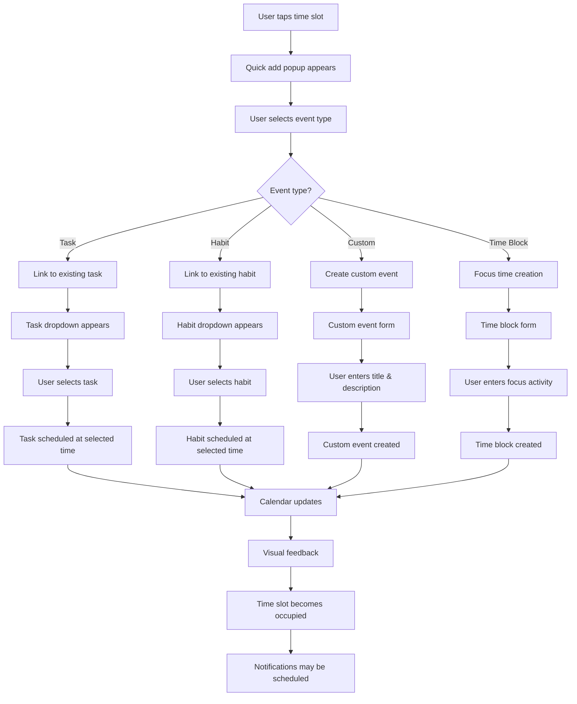
```mermaid
graph TD
    A[User taps time slot] --> B[Quick add popup appears]
    B --> C[User selects event type]
    C --> D{Event type?}
    D -->|Task| E[Link to existing task]
    D -->|Habit| F[Link to existing habit]
    D -->|Custom| G[Create custom event]
    D -->|Time Block| H[Focus time creation]
    E --> I[Task dropdown appears]
    F --> J[Habit dropdown appears]
    G --> K[Custom event form]
    H --> L[Time block form]
    I --> M[User selects task]
    J --> N[User selects habit]
    K --> O[User enters title & description]
    L --> P[User enters focus activity]
    M --> Q[Task scheduled at selected time]
    N --> R[Habit scheduled at selected time]
    O --> S[Custom event created]
    P --> T[Time block created]
    Q --> U[Calendar updates]
    R --> U
    S --> U
    T --> U
    U --> V[Visual feedback]
    V --> W[Time slot becomes occupied]
    W --> X[Notifications may be scheduled]
```

---

## 📝 **JOURNAL SYSTEM FLOWS**

### **Journal Entry Creation Flow**
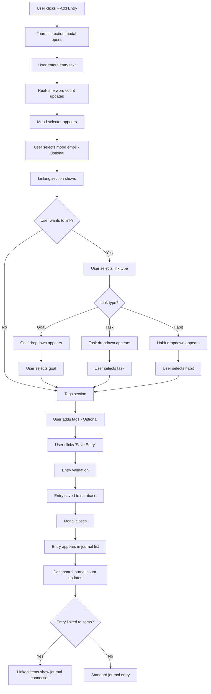
```mermaid
graph TD
    A[User clicks + Add Entry] --> B[Journal creation modal opens]
    B --> C[User enters entry text]
    C --> D[Real-time word count updates]
    D --> E[Mood selector appears]
    E --> F[User selects mood emoji - Optional]
    F --> G[Linking section shows]
    G --> H{User wants to link?}
    H -->|Yes| I[User selects link type]
    H -->|No| J[Tags section]
    I --> K{Link type?}
    K -->|Goal| L[Goal dropdown appears]
    K -->|Task| M[Task dropdown appears]
    K -->|Habit| N[Habit dropdown appears]
    L --> O[User selects goal]
    M --> P[User selects task]
    N --> Q[User selects habit]
    O --> J
    P --> J
    Q --> J
    J --> R[User adds tags - Optional]
    R --> S[User clicks 'Save Entry']
    S --> T[Entry validation]
    T --> U[Entry saved to database]
    U --> V[Modal closes]
    V --> W[Entry appears in journal list]
    W --> X[Dashboard journal count updates]
    X --> Y{Entry linked to items?}
    Y -->|Yes| Z[Linked items show journal connection]
    Y -->|No| AA[Standard journal entry]
```

### **Auto-Prompt Generation Flow**
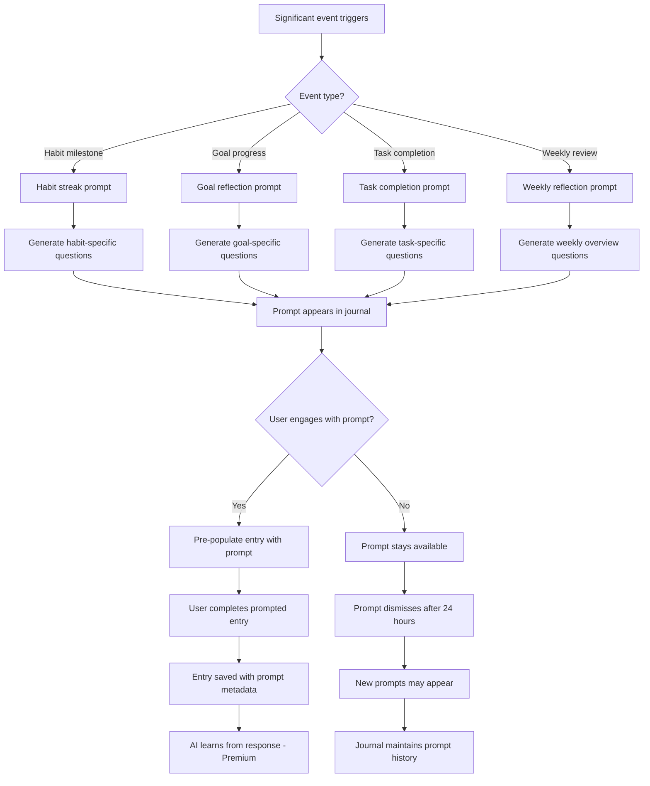
```mermaid
graph TD
    A[Significant event triggers] --> B{Event type?}
    B -->|Habit milestone| C[Habit streak prompt]
    B -->|Goal progress| D[Goal reflection prompt]
    B -->|Task completion| E[Task completion prompt]
    B -->|Weekly review| F[Weekly reflection prompt]
    C --> G[Generate habit-specific questions]
    D --> H[Generate goal-specific questions]
    E --> I[Generate task-specific questions]
    F --> J[Generate weekly overview questions]
    G --> K[Prompt appears in journal]
    H --> K
    I --> K
    J --> K
    K --> L{User engages with prompt?}
    L -->|Yes| M[Pre-populate entry with prompt]
    L -->|No| N[Prompt stays available]
    M --> O[User completes prompted entry]
    N --> P[Prompt dismisses after 24 hours]
    O --> Q[Entry saved with prompt metadata]
    P --> R[New prompts may appear]
    Q --> S[AI learns from response - Premium]
    R --> T[Journal maintains prompt history]
```

### **Journal Entry Viewing Flow**
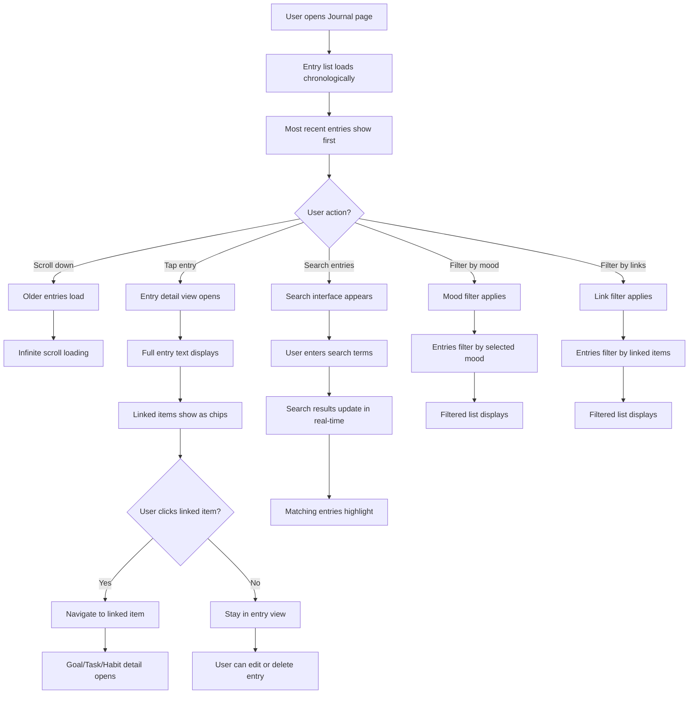
```mermaid
graph TD
    A[User opens Journal page] --> B[Entry list loads chronologically]
    B --> C[Most recent entries show first]
    C --> D{User action?}
    D -->|Scroll down| E[Older entries load]
    D -->|Tap entry| F[Entry detail view opens]
    D -->|Search entries| G[Search interface appears]
    D -->|Filter by mood| H[Mood filter applies]
    D -->|Filter by links| I[Link filter applies]
    E --> J[Infinite scroll loading]
    F --> K[Full entry text displays]
    G --> L[User enters search terms]
    H --> M[Entries filter by selected mood]
    I --> N[Entries filter by linked items]
    K --> O[Linked items show as chips]
    L --> P[Search results update in real-time]
    M --> Q[Filtered list displays]
    N --> R[Filtered list displays]
    O --> S{User clicks linked item?}
    P --> T[Matching entries highlight]
    S -->|Yes| U[Navigate to linked item]
    S -->|No| V[Stay in entry view]
    U --> W[Goal/Task/Habit detail opens]
    V --> X[User can edit or delete entry]
```

---

## 🤖 **AI PREMIUM FEATURES FLOWS**

### **AI Insights Generation Flow**
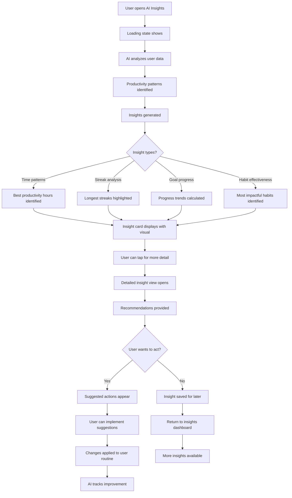
```mermaid
graph TD
    A[User opens AI Insights] --> B[Loading state shows]
    B --> C[AI analyzes user data]
    C --> D[Productivity patterns identified]
    D --> E[Insights generated]
    E --> F{Insight types?}
    F -->|Time patterns| G[Best productivity hours identified]
    F -->|Streak analysis| H[Longest streaks highlighted]
    F -->|Goal progress| I[Progress trends calculated]
    F -->|Habit effectiveness| J[Most impactful habits identified]
    G --> K[Insight card displays with visual]
    H --> K
    I --> K
    J --> K
    K --> L[User can tap for more detail]
    L --> M[Detailed insight view opens]
    M --> N[Recommendations provided]
    N --> O{User wants to act?}
    O -->|Yes| P[Suggested actions appear]
    O -->|No| Q[Insight saved for later]
    P --> R[User can implement suggestions]
    Q --> S[Return to insights dashboard]
    R --> T[Changes applied to user routine]
    S --> U[More insights available]
    T --> V[AI tracks improvement]
```

### **Smart Suggestions Flow**
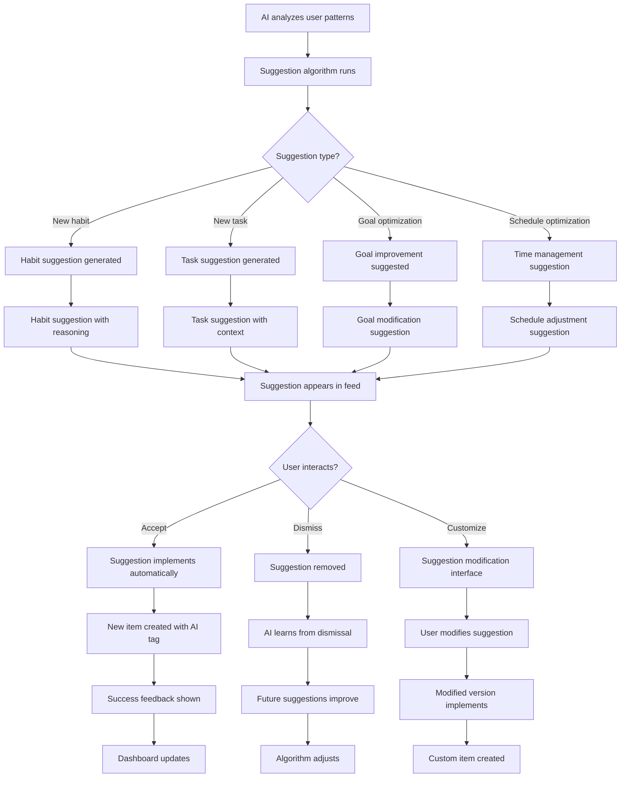
```mermaid
graph TD
    A[AI analyzes user patterns] --> B[Suggestion algorithm runs]
    B --> C{Suggestion type?}
    C -->|New habit| D[Habit suggestion generated]
    C -->|New task| E[Task suggestion generated]
    C -->|Goal optimization| F[Goal improvement suggested]
    C -->|Schedule optimization| G[Time management suggestion]
    D --> H[Habit suggestion with reasoning]
    E --> I[Task suggestion with context]
    F --> J[Goal modification suggestion]
    G --> K[Schedule adjustment suggestion]
    H --> L[Suggestion appears in feed]
    I --> L
    J --> L
    K --> L
    L --> M{User interacts?}
    M -->|Accept| N[Suggestion implements automatically]
    M -->|Dismiss| O[Suggestion removed]
    M -->|Customize| P[Suggestion modification interface]
    N --> Q[New item created with AI tag]
    O --> R[AI learns from dismissal]
    P --> S[User modifies suggestion]
    Q --> T[Success feedback shown]
    R --> U[Future suggestions improve]
    S --> V[Modified version implements]
    T --> W[Dashboard updates]
    U --> X[Algorithm adjusts]
    V --> Y[Custom item created]
```

### **AI Assistant Chat Flow**
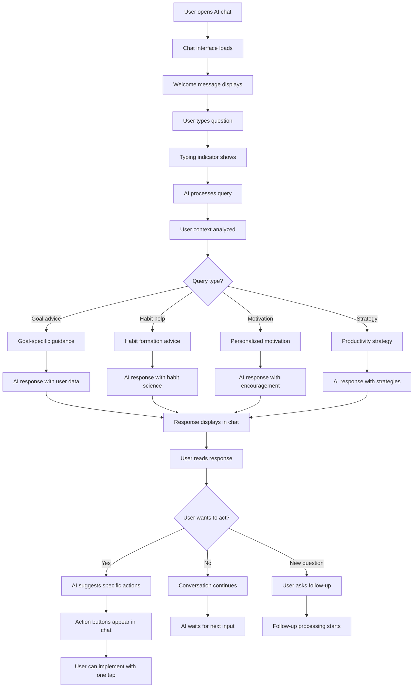
```mermaid
graph TD
    A[User opens AI chat] --> B[Chat interface loads]
    B --> C[Welcome message displays]
    C --> D[User types question]
    D --> E[Typing indicator shows]
    E --> F[AI processes query]
    F --> G[User context analyzed]
    G --> H{Query type?}
    H -->|Goal advice| I[Goal-specific guidance]
    H -->|Habit help| J[Habit formation advice]
    H -->|Motivation| K[Personalized motivation]
    H -->|Strategy| L[Productivity strategy]
    I --> M[AI response with user data]
    J --> N[AI response with habit science]
    K --> O[AI response with encouragement]
    L --> P[AI response with strategies]
    M --> Q[Response displays in chat]
    N --> Q
    O --> Q
    P --> Q
    Q --> R[User reads response]
    R --> S{User wants to act?}
    S -->|Yes| T[AI suggests specific actions]
    S -->|No| U[Conversation continues]
    S -->|New question| V[User asks follow-up]
    T --> W[Action buttons appear in chat]
    U --> X[AI waits for next input]
    V --> Y[Follow-up processing starts]
    W --> Z[User can implement with one tap]
```

---

## 📊 **DASHBOARD & ANALYTICS FLOWS**

### **Dashboard Loading Flow**
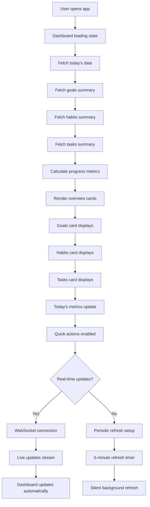
```mermaid
graph TD
    A[User opens app] --> B[Dashboard loading state]
    B --> C[Fetch today's data]
    C --> D[Fetch goals summary]
    D --> E[Fetch habits summary]
    E --> F[Fetch tasks summary]
    F --> G[Calculate progress metrics]
    G --> H[Render overview cards]
    H --> I[Goals card displays]
    I --> J[Habits card displays]
    J --> K[Tasks card displays]
    K --> L[Today's metrics update]
    L --> M[Quick actions enabled]
    M --> N{Real-time updates?}
    N -->|Yes| O[WebSocket connection]
    N -->|No| P[Periodic refresh setup]
    O --> Q[Live updates stream]
    P --> R[5-minute refresh timer]
    Q --> S[Dashboard updates automatically]
    R --> T[Silent background refresh]
```

### **Progress Calculation Flow**
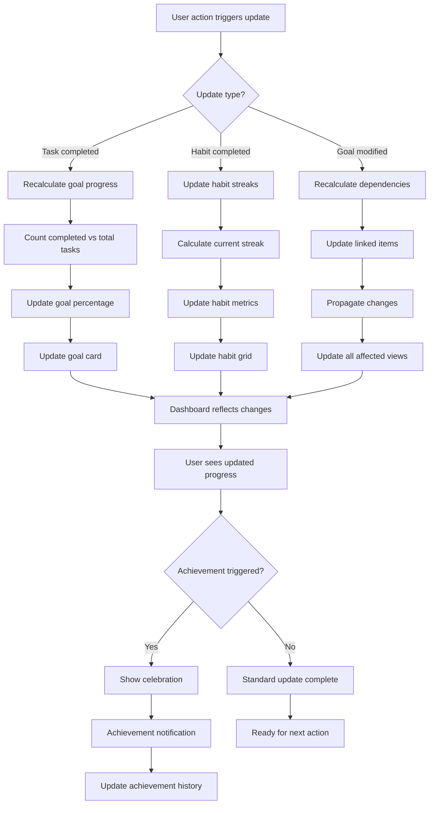
```mermaid
graph TD
    A[User action triggers update] --> B{Update type?}
    B -->|Task completed| C[Recalculate goal progress]
    B -->|Habit completed| D[Update habit streaks]
    B -->|Goal modified| E[Recalculate dependencies]
    C --> F[Count completed vs total tasks]
    D --> G[Calculate current streak]
    E --> H[Update linked items]
    F --> I[Update goal percentage]
    G --> J[Update habit metrics]
    H --> K[Propagate changes]
    I --> L[Update goal card]
    J --> M[Update habit grid]
    K --> N[Update all affected views]
    L --> O[Dashboard reflects changes]
    M --> O
    N --> O
    O --> P[User sees updated progress]
    P --> Q{Achievement triggered?}
    Q -->|Yes| R[Show celebration]
    Q -->|No| S[Standard update complete]
    R --> T[Achievement notification]
    S --> U[Ready for next action]
    T --> V[Update achievement history]
```

This comprehensive flow documentation ensures every developer knows exactly how each feature should work! 🎯🔥

Would you like me to continue with more specific flows like Settings, Authentication, or Data Sync flows?